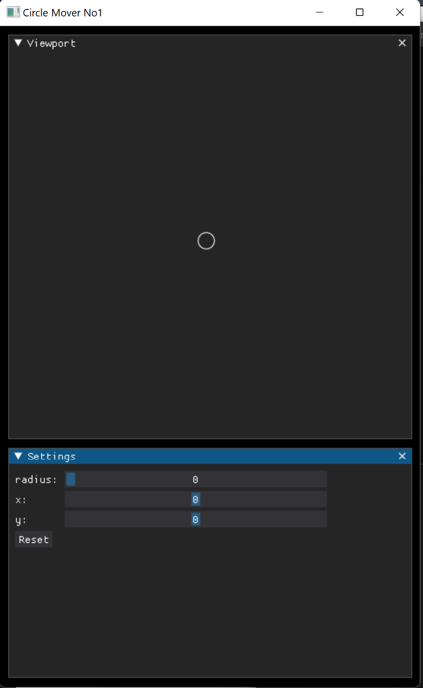
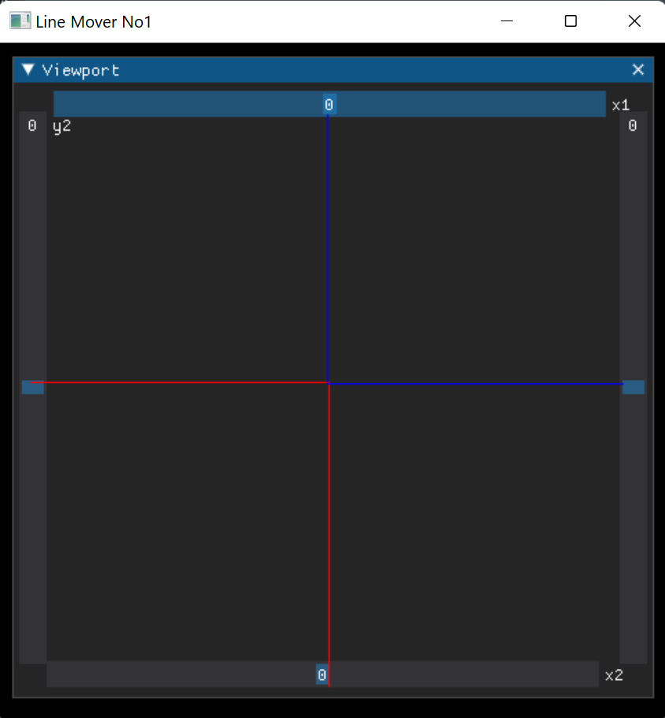

# Simple DearPyGui Demos

I'll collect here my school's DearPyGui projects.  
use:  
*Windows11  
python 3.10.6 and python 3.11 
dearpygui 1.6.2*  and 1.9.0   

### done

### done

https://github.com/TechnoLukas/MyDearPyGui_CollegeProjects/tree/main/SimpleDearPyGuiDemos
